# Fresh Fork: Eat fresh , Order easy.
**A Full-stack food ordering web application**

<div style="float: right; margin-left: 20px;">
  
</div>

**Fresh Fork** is a real-time food ordering platform designed to streamline the restaurant dining experience by connecting **customers, agents (waiters), and administrators** within a single ecosystem. Users can browse dishes, add items to their cart, and place orders online with secure **Razorpay** integration. Orders are automatically assigned to active agents (waiters) in a **load-balanced manner**, ensuring fair task distribution. If no agents are active, order placement is restricted to maintain workflow integrity.

Agents receive assigned orders, manage order preparation and delivery status, and update progress in real-time. Meanwhile, administrators can **add, edit, enable, or disable dishes**, manage user roles, and monitor system analytics.

This project demonstrates the use of **Django for backend logic and APIs**, **React** for an interactive frontend, and **PostgreSQL** for structured data management. The system aims to simplify order handling, reduce manual delays, and ensure a transparent, efficient dining experience for all stakeholders.
## Workflow
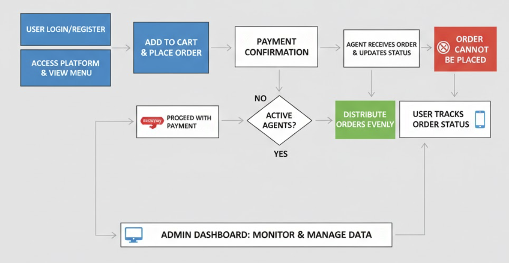

## 🚀 Key Features

The **Food Ordering Platform** offers a seamless experience for users, agents (waiters), and admins:

### 👤 User Features
- **Register/Login**: Secure authentication for user accounts.
- **Browse Dishes**: Explore available dishes with ease.
- **Add to Cart & Order**: Add dishes to cart and place orders effortlessly.
- **Secure Payments**: Pay securely using Razorpay integration.
- **Track Orders**: Monitor order status in real-time (Ordered → Accepted → Preparing → Delivered).

### 👨‍🍳 Agent (Waiter) Features
- **View Orders**: Dynamically view assigned orders.
- **Update Status**: Accept or update order statuses in real-time.
- **Load-Balanced Assignment**: Evenly distributed orders among active agents.
- **Availability Control**: Set active/inactive status to manage availability.

### 🛠️ Admin Features
- **Manage Users & Agents**: Full control over user and agent accounts.
- **Dish Management**: Enable/disable dishes based on availability.
- **Monitor Activity**: Track orders, payments, and delivery operations.
- **Platform Control**: Oversee all platform operations with an admin dashboard.


## Tech Stack
| Layer              | Technology                        |
|--------------------|-----------------------------------|
| **Frontend**       | React.js, Bootstrap          |
| **Backend**        | Django, Django REST Framework     |
| **Database**       | PostgreSQL                        |
| **Payment Gateway**| Razorpay                          |
| **Authentication** | Django Auth / JWT Tokens          |
| **Version Control**| Git, GitHub                       |

## Project Setup

Run the following command

**Step 1: Clone the Repository**

```bash
#Clone the Project 
git clone https://github.com/adhilogu/cafe.git

# Create virtual environment (recommended) 
python -m venv venv

# Activate virtual environment
# On Windows:
venv\Scripts\activate

# On macOS/Linux:
source venv/bin/activate

# Install dependencies
pip install -r requirements.txt

# Configure database settings in settings.py
# Update DATABASES configuration with your PostgreSQL credentials or use sqlite
```

**Step 2: Project setup**
```bash
# Run migrations
python manage.py makemigrations
python manage.py migrate
python manage.py collectstatic
```

```bash
# Create superuser (admin)
python manage.py createsuperuser
```
**username**:admin

**password**:Pass__

**Step 3: Start server**

```bash
python manage.py runserver 8000
```


At this point, the app runs at https://127.0.0.1:8000/
Admin panel at  https://127.0.0.1:8000/admin

**❗ Create user profiles and Set Role accordingly [user,agent].**
**Users with role "Agent" can only take Orders and 	Agent status should be "True".**


## [Snapshots of the project]

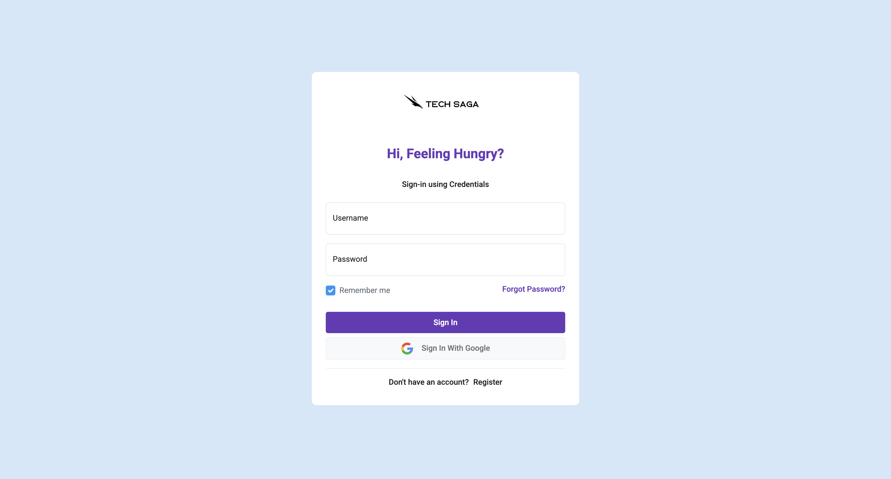
Login page

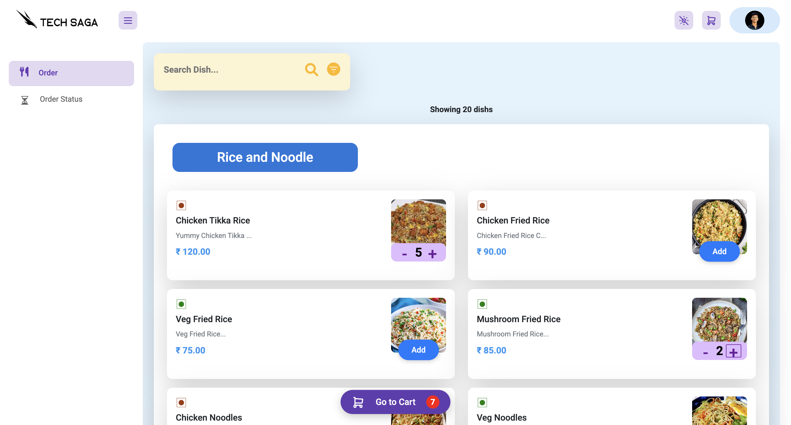
Order page

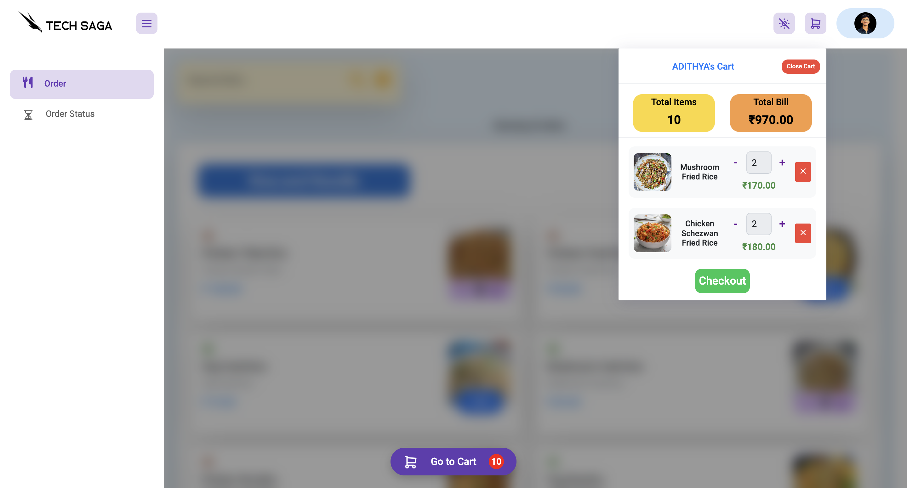
Cart to add food

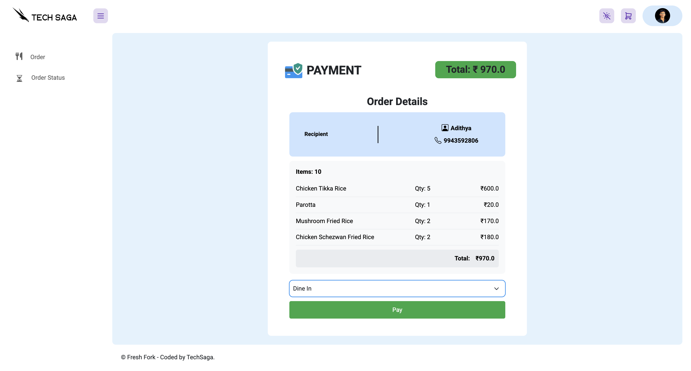
Payments page

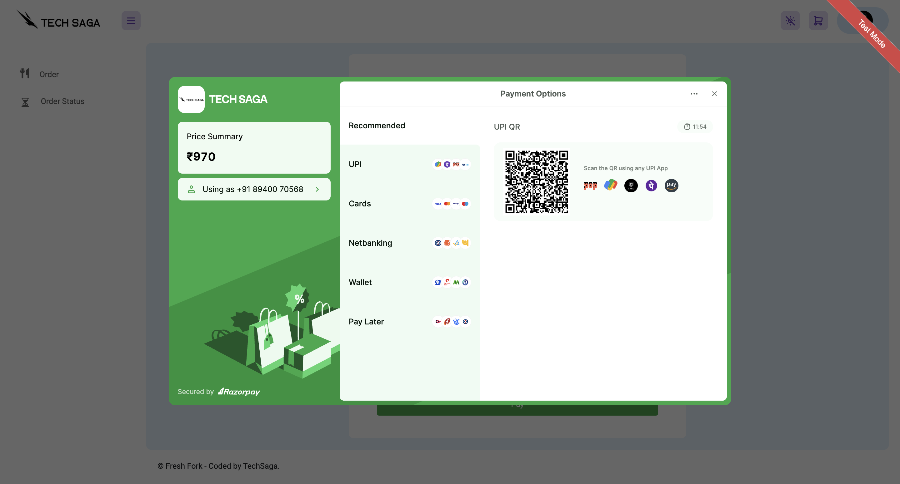
Razorpay

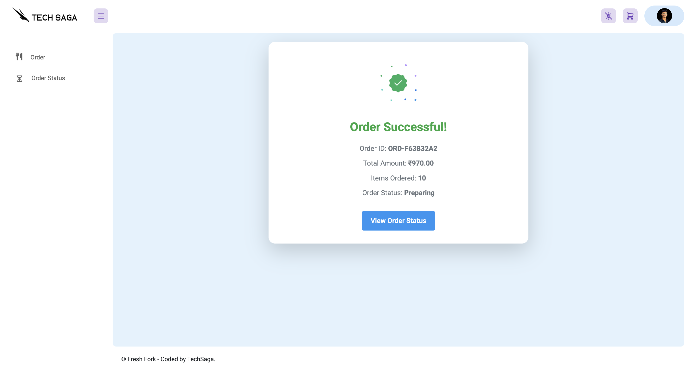
Order success

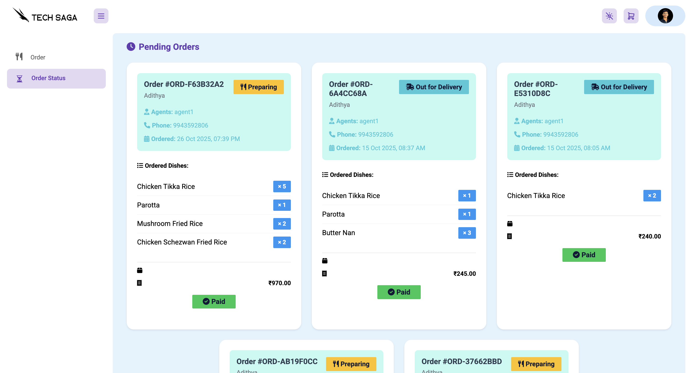
View the status of your order

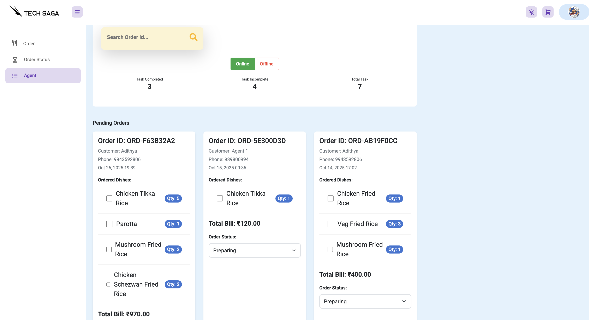
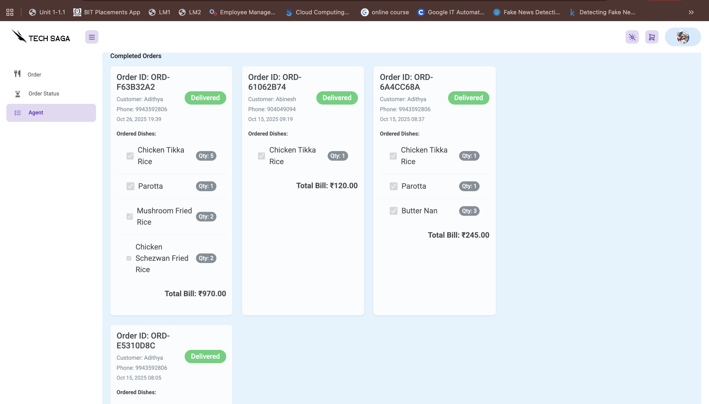
Agent Page

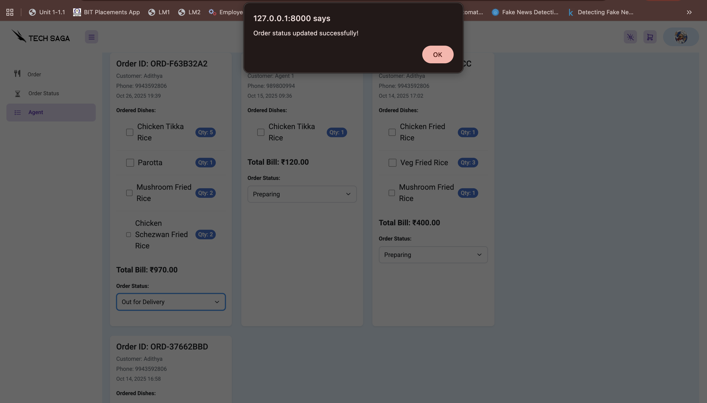
Agent updating order status

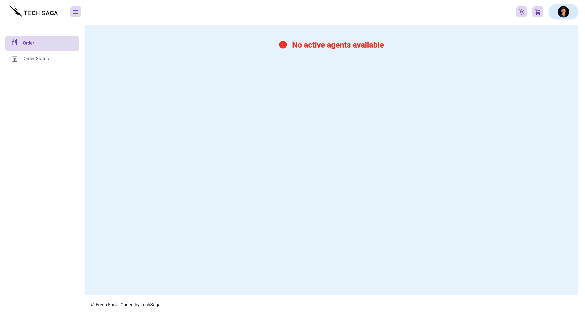
No order can be made if there are no active agents 

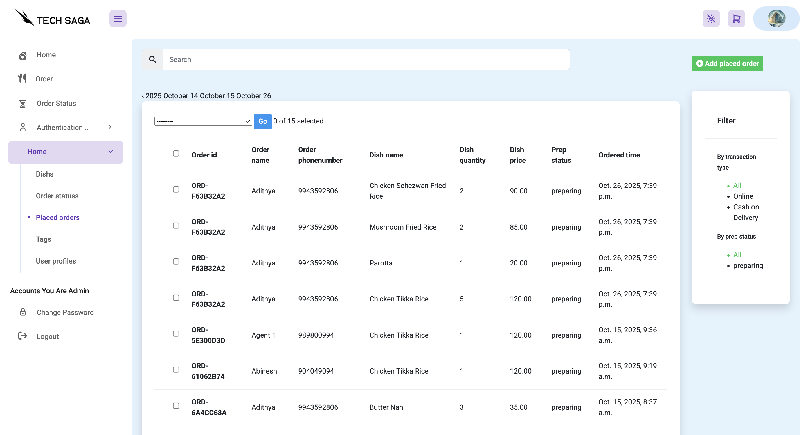
Admin Panel

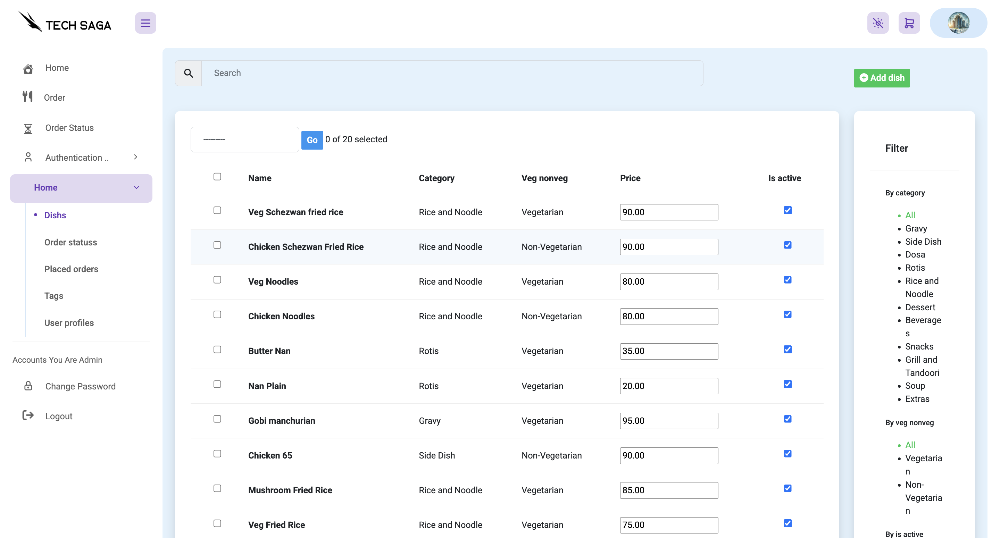
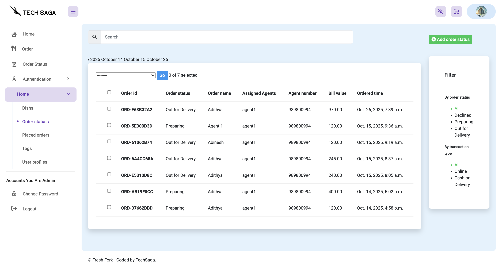
List of Orders and Dishes(admin panel)

---
## Demo
 (Wait Loading..)
---
## 📧 Support

<div style="text-align: left;">
  
  <p>Email: <a href="mailto:adhilogu2004@gmail.com">adhilogu2004@gmail.com</a></p>
</div>


[](https://www.linkedin.com/in/adithya-loganathan-a47218283/)
[](https://www.instagram.com/adithyaloganathanh/?hl=en)
[](https://github.com/adhilogu)


